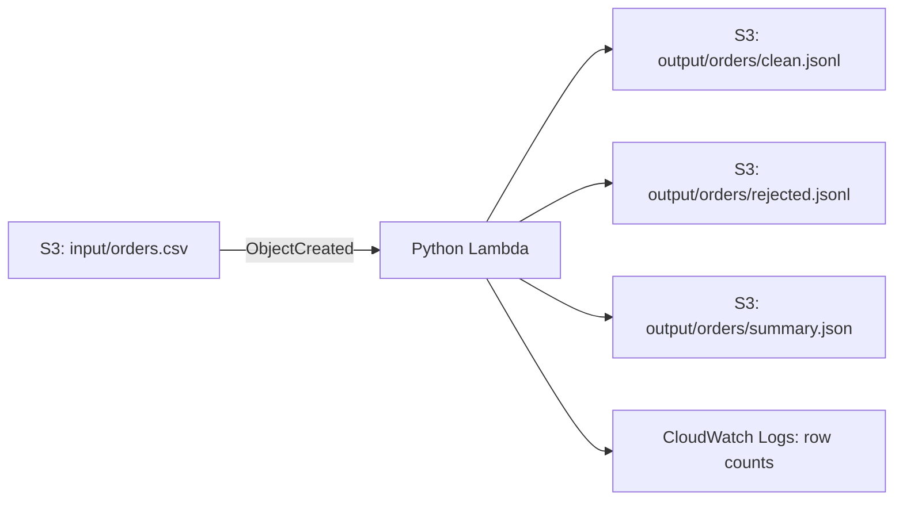

# AWS S3 + Lambda Orders ETL

A small, reproducible data engineering project. Upload a CSV file to Amazon S3, and an AWS Lambda function validates the rows, standardizes city names, and writes clean data, rejected data, and a daily sales summary back to S3.



## What it demonstrates

- Event-driven ETL with S3 and Lambda
- Data validation with a reject file that explains each failed row
- An aggregate table by date and city
- Narrow IAM permissions for input and output prefixes
- Deterministic output keys: uploading the same filename again replaces its three outputs
- Local tests for transformation and S3 integration behavior

## Input schema

| Column | Rule |
| --- | --- |
| `order_id` | Required; unique within one CSV file |
| `order_date` | Real date in `YYYY-MM-DD` format |
| `city` | Required; leading/trailing spaces removed and title-cased |
| `amount_cents` | Positive whole number |

The six-row [sample CSV](sample_data/orders.csv) produces three clean rows and three rejected rows. The [expected outputs](sample_data/expected) show the resulting files.

## Deploy using the AWS Console

This version extends the original project using the **same S3 bucket, Lambda function, IAM role, and S3 trigger**. No additional AWS service is needed.

1. In Lambda, select `orders-cleaner` in **Asia Pacific (Sydney), `ap-southeast-2`**.
2. In the **Code** tab, replace the contents of `lambda_function.py` with the file in this repository. Click **Deploy**.
3. Keep the existing S3 trigger: **Object created**, prefix `input/`, suffix `.csv`.
4. Keep the role's S3 policy. It needs `s3:GetObject` on `arn:aws:s3:::au-orders-demo/input/*` and `s3:PutObject` on `arn:aws:s3:::au-orders-demo/output/*`. The exact policy is in [iam-policy.json](iam-policy.json). Lambda's basic execution policy handles CloudWatch logging.
5. Upload [sample_data/orders.csv](sample_data/orders.csv) to S3 as `input/orders.csv`. If that key already exists, choose **Overwrite**. Upload **after** deploying the new code to trigger it.
6. Open the three files under `output/orders/` in S3. The summary should report `valid_count: 3` and `rejected_count: 3`. In Lambda's **Monitor → View CloudWatch logs**, look for `valid=3 rejected=3`.

The older `output/orders.jsonl` from version 1 is separate and can be deleted after comparing results. The trigger listens only to `input/*.csv`, so writing to `output/` does not invoke the function again.

## Run the tests locally

Python 3.9 or newer is sufficient. No packages or AWS credentials are needed for the tests.

```bash
python3 -m unittest discover -s tests -v
```

## Cost and cleanup

The sample is under 1 MB and uses one S3 upload, one Lambda invocation, three S3 output writes, and small CloudWatch logs. **AWS account plan and remaining credits still determine billing.** The AWS Free plan does not charge until an upgrade to Paid, and AWS ends the Free plan after six months or when its credits are exhausted, whichever occurs first. Check your account's **Cost and Usage** widget rather than assuming an account is on the Free plan. [AWS Free Tier FAQ](https://aws.amazon.com/free/free-tier-faqs/) · [Lambda pricing](https://aws.amazon.com/lambda/pricing/) · [S3 pricing](https://aws.amazon.com/s3/pricing/)

To clean up after collecting evidence for your portfolio, remove the S3 trigger, delete the Lambda function, empty and delete the bucket, and delete its CloudWatch log group. The files in this repository remain available on GitHub.

## Portfolio evidence

Include a screenshot of the three output objects and the CloudWatch row counts. Crop out your AWS account ID and any personal details before publishing. Never commit AWS access keys or credentials.
