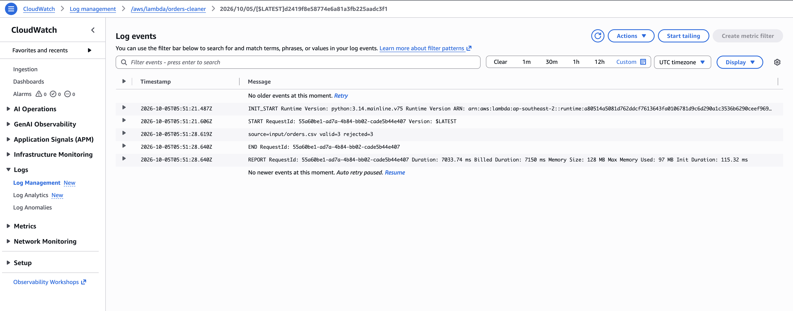
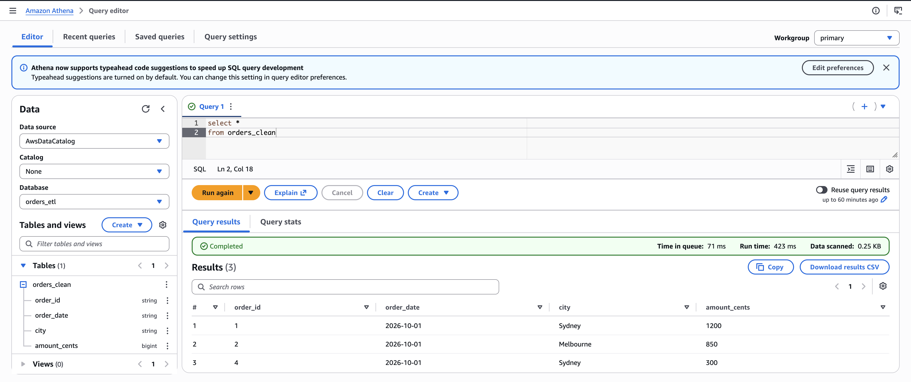

# AWS S3 + Lambda Orders ETL

A small, reproducible data engineering project. Upload a CSV file to Amazon S3, and an AWS Lambda function validates the rows, standardizes city names, and writes clean data, rejected data, and a daily sales summary back to S3.


## What it demonstrates

- Event-driven ETL with S3 and Lambda
- Athena external table for querying the clean JSON Lines output
- Data validation with a reject file that explains each failed row
- An aggregate table by date and city
- Narrow IAM permissions for input and output prefixes
- Deterministic output keys: uploading the same filename again replaces its three outputs
- Local tests for transformation and S3 integration behavior

## Input schema

| Column | Rule |
| --- | --- |
| `order_id` | Required; unique within one CSV file |
| `order_date` | Real date in `YYYY-MM-DD` format |
| `city` | Required; leading/trailing spaces removed and title-cased |
| `amount_cents` | Positive whole number |

The six-row [sample CSV](sample_data/orders.csv) produces three clean rows and three rejected rows. The [expected outputs](sample_data/expected) show the resulting files.

## Example run

The six-row sample produces three valid and three rejected orders. The CloudWatch log records the Lambda row counts.



Athena reads the three valid orders from `orders_etl.orders_clean`.



## Deploy using the AWS Console

The Lambda pipeline reuses the **same S3 bucket, Lambda function, IAM role, and S3 trigger**. Athena reads the clean output using a table definition; it does not copy the data.

1. In Lambda, select `orders-cleaner` in **Asia Pacific (Sydney), `ap-southeast-2`**.
2. In the **Code** tab, replace the contents of `lambda_function.py` with the file in this repository. Click **Deploy**.
3. Keep the existing S3 trigger: **Object created**, prefix `input/`, suffix `.csv`.
4. Keep the role's S3 policy. It needs `s3:GetObject` on `arn:aws:s3:::au-orders-demo/input/*` and `s3:PutObject` on `arn:aws:s3:::au-orders-demo/output/*`. The exact policy is in [iam-policy.json](iam-policy.json). Lambda's basic execution policy handles CloudWatch logging.
5. Upload [sample_data/orders.csv](sample_data/orders.csv) to S3 as `input/orders.csv`. If that key already exists, choose **Overwrite**. Upload **after** deploying the new code to trigger it.
6. Open `output/clean/orders.jsonl`, `output/rejected/orders.jsonl`, and `output/summary/orders.json` in S3. The summary should report `valid_count: 3` and `rejected_count: 3`. In Lambda's **Monitor → View CloudWatch logs**, look for `valid=3 rejected=3`.

The older `output/orders.jsonl` is a version 1 artifact and is not used by this pipeline. The trigger listens only to `input/*.csv`, so writing to `output/` does not invoke the function again.

## Query the clean output with Athena

1. Open Athena in **Asia Pacific (Sydney), `ap-southeast-2`**, and set the query result location to `s3://au-orders-demo/athena-results/`.
2. Run the statements in [Athena.sql](Athena.sql) one at a time: create the database, create the external table, and query the clean orders.
3. The sample query should return three rows. The table reads only `output/clean/`, so rejected rows and summary files are excluded.

Athena SELECT queries scan data and can consume Free plan credits. Query results are stored in the `athena-results/` prefix of the same bucket.

## Run the tests locally

Python 3.9 or newer is sufficient. No packages or AWS credentials are needed for the tests.

```bash
python3 -m unittest discover -s tests -v
```

## Cost profile

The sample CSV is under 1 MB. Processing it uses one S3 upload, one Lambda invocation, three S3 output writes, and CloudWatch logging. Athena queries scan the clean output, store results in S3, and use AWS Glue Data Catalog metadata. Charges depend on account plan, remaining credits, and usage. [AWS Free Tier FAQ](https://aws.amazon.com/free/free-tier-faqs/) · [Athena pricing](https://aws.amazon.com/athena/pricing/) · [Lambda pricing](https://aws.amazon.com/lambda/pricing/) · [S3 pricing](https://aws.amazon.com/s3/pricing/)
